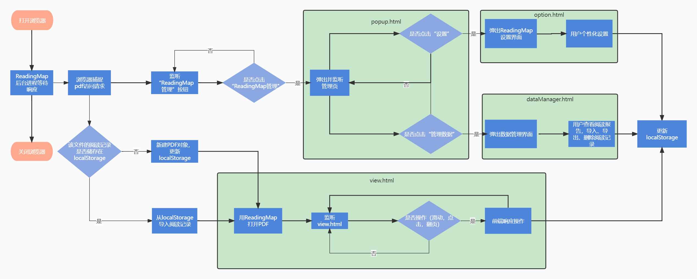

 # 开发说明书

&emsp; ReadingMap是一款在浏览器环境下运行的纯前端插件，目前支持Chrome浏览器和Edge浏览器，使用浏览器原生存储器LocalStorage，支持实时载入和导出数据。

###  编程语言
&emsp; JavaScript 88%
 &emsp;   Css 9%
  &emsp;  Html 3%

### 第三方开源组件

&emsp; 该产品使用的第三方开源组件有[PDF.js](https://github.com/mozilla/pdf.js)和[Echarts.js](https://echarts.apache.org/zh/index.html)。该产品的部分功能以PDF Viewer为基础，PDF Viewer是一款基于PDF.js的Chrome浏览器插件，它会在用户浏览PDF文件时用PDF.js渲染出的结果替代浏览器原生解析器生成的结果。第三方开源组件均遵循Apache-2.0协议。

### 流程说明
&emsp; ReadingMap在浏览器打开时启动，并在后台监听“打开PDF文件”请求。当PDF文件在浏览器中打开时，ReadingMap解析PDF文件，并且在本地存储资源中查找该文件相关数据，通过整合计算将渲染后的PDF文件载入浏览器页面。ReadingMap特色组件会实时监听用户操作，并做出响应，将用户行为数据存储到LoacalStorage中。
&emsp; 当用户进行数据管理时，ReadingMap会对LoacalStorage进行读写操作，以保证数据同步。
&emsp; ReadingMap流程概览如下图所示。

   <div align="center">
       
   </div>
<!--  -->


```
文件结构说明
│  contentscript.js
│  contentstyle.css
│  extension-router.js
│  manifest.json            #配置文件
│  page-background.png      #磨砂质感的背景
│  pdfHandler-vcros.js
│  pdfHandler.html          #应用进程的后台运行环境
│  pdfHandler.js
│  preferences_schema.json  #PDF Viewer的设置选项信息
│  preserve-referer.js      #记录用户的请求头，让PDF Viewer可以访问到用户打开的网络pdf资源
│  restoretab.html  
│  restoretab.js            #PDF Viewer关于恢复页面过程的补丁
│  suppress-update.js       #让PDF Viewer等到所有已打开的pdf均已关闭之后再进行版本更新
│  upgradeOldData.js        #用于迁移旧版本ReadingMap产生的格式不同的数据
│
├─content
│  ├─build                  #第三方库pdf.js
│  │      pdf.js
│  │      pdf.worker.js
│  │
│  └─web
│      │  debugger.js
│      │  memoryManagement.js   #内存管理
│      │  readingMap.css        #ReadingMap核心功能
│      │  readingMap.js
│      │  readingMapClasses.js
│      │  translate.js
│      │  viewer.css            #PDF浏览视图
│      │  viewer.html
│      │  viewer.js
│      │
│      ├─cmaps
│      │
│      ├─images
│      │
│      └─locale             #语言库
│ 
│
├─dataManager               #数据管理
│      browserData.html     #浏览器数据管理界面
│      browserData.js       #浏览器数据管理js
│      dataManager.css      #数据管理组件css
│      dataManager.js       #数据管理组件js
│      homepage.html        #主页界面
│      homepage.js          #主页js
│      localData.html       #本地数据管理界面
│      localData.js         #本地数据管理js
│      mergeFiles.html      #数据合并界面
│      mergeFiles.js        #数据合并js
│      readingSummary.js    #阅读报告js
│      section.css          #导航栏css
│      echarts.min.js       #第三方开源库echarts
│
├─doc   # 开发文档
│      backlog.xlsx
│
├─options   # PDF Viewer的设置页面
│      migration.js
│      options.css
│      options.html
│      options.js
│      rmOptions.js
│
├─pageAction    # ReadingMap的控制坞
│      background.js
│      popup.css
│      popup.html
│      popup.js
│
├─pics  # 文档中的图片
│
├─readingSummary    # ReadingMap统计图表功能
│      echarts.min.js
│      readingSummary.html
│      readingSummary.js
│
└─rmImages  # 界面中的图片素材
    │  add.png
    │  cycle_eye.png
    │  overwrite.png
    │  point.png
    │  point2.png
    │  progressMark - ori.png
    │  progressMark.png
    │
    └─markers
            defaultMarker.png
            Marker.png
```
