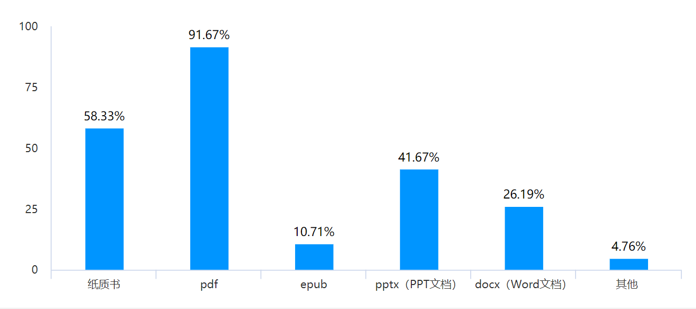
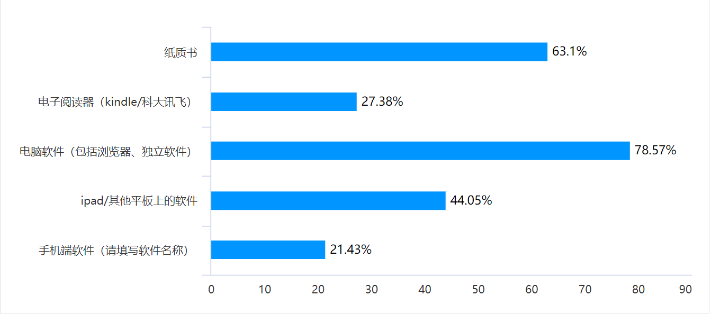
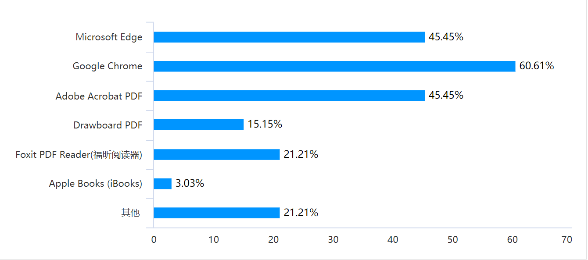
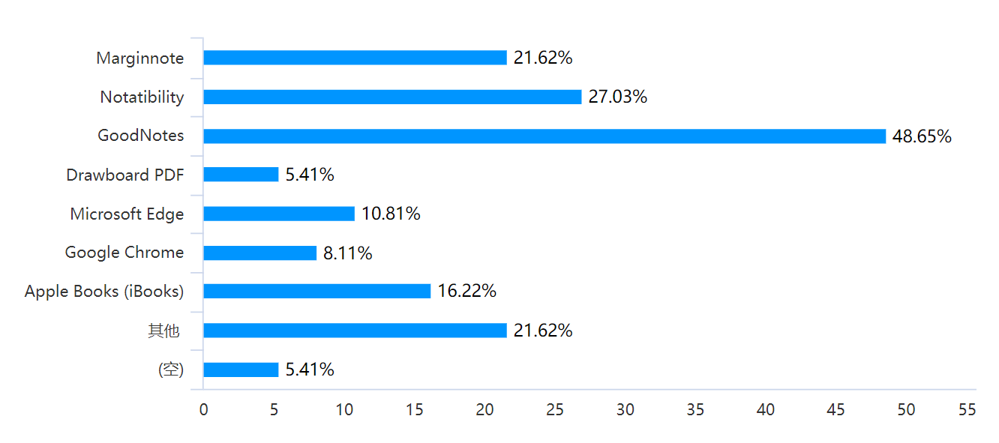
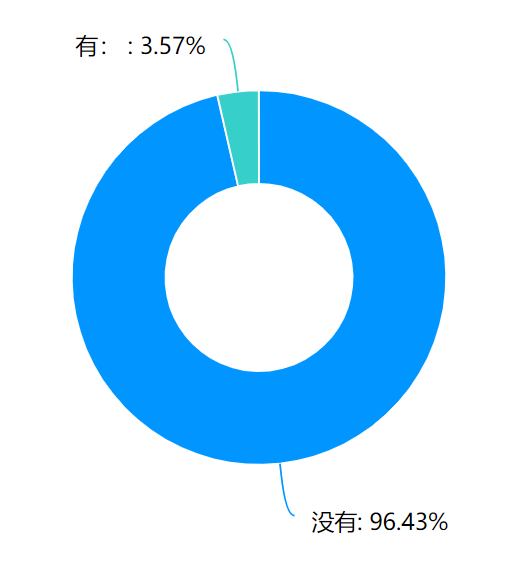
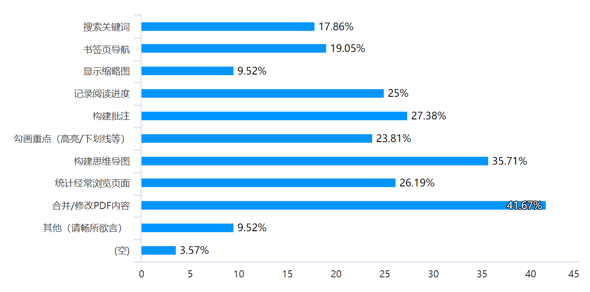
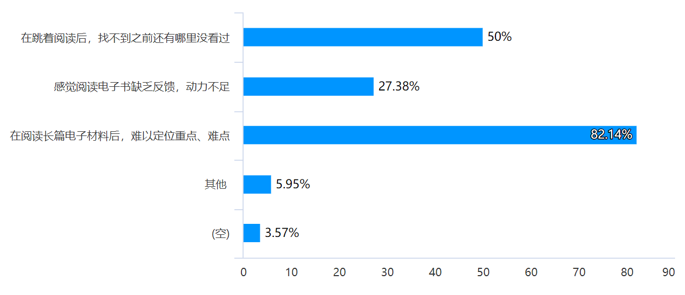
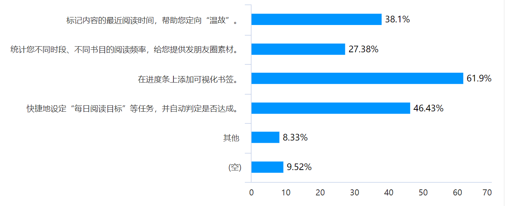
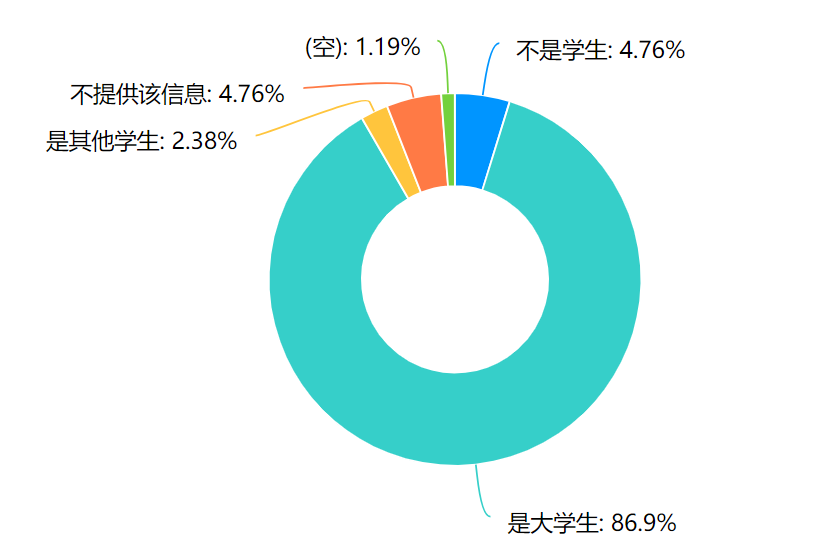
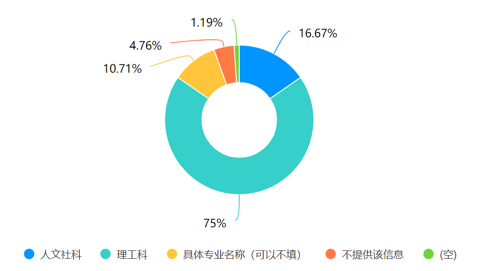

## 问卷回收分析

为了更好的了解用户现状及需求，我们制作了线上问卷，并发放回收。

问卷链接如下（持续开放）：https://www.wjx.cn/vj/wFVhkbI.aspx

截至2022.4.6，共计回收问卷84份

> **为了了解目标用户的现状，我们提出以下问题**

1. ##### 您常用（占总阅读时间>30%）的阅读材料格式有哪些？

   

​		分析：我们的插件主要满足pdf的阅读需求，能够解决大多数需求

2. ##### 您常用的阅读媒介包括：

   

​		分析：除纸质书外，对于电脑端软件浏览pdf需求较大

##### 2.1. 您最常用以阅读材料的电脑端软件包括：

其他包括：PDFexpert，MAC preview，Sumatra PDF， WPS，CAJ viewer，PDF Guru

分析：对于电脑端用户，我们的插件预计在google chrome上架，同时可以通过Github下载，运行于各浏览器，适用范围较广

##### 2.2. 您在ipad/平板上最常用以阅读的软件包括：

分析：对于常使用平板的用户，也可满足部分浏览器阅读需求

> 2.1/2.2 反映问卷逻辑
>
> 后续题号与问卷中题号对标

5. ##### 您有没有在edge/chrome上安装额外的pdf浏览相关插件？如果有，它们叫什么名字？

分析：大部分用户没有安装pdf浏览插件，市场潜力大；仅有三位安装插件的受访者安装过Acrobat/Acrobat Pro/endnote，但反映其中endnote不易使用

> **为了了解目标用户的困难和需求，我们提出如下问题**

6. ##### 您认为您现在所用的阅读媒介**缺少的**功能中，最重要的有哪些？

   

   其他：

   * 页面简洁
   * 某个时刻浏览页面
   * 笔记云同步多端有序
   * 翻译
   * 智能识别并自由编辑目录和大纲
   * 增加新的空白页、查看历史版本、hashtags
   * 跳至指定页（goodnote没有）
   * 批注和划重点不能说缺少，但pdf相关功能难用到相当于没有；希望pdf能有类似word的批注

   

7. ##### 您阅读时会遇到哪些困难？

   

   其他：

   * 无法像纸质书那样手指夹着好几个不同页面进行递归学习
   * 在电脑上阅读密密麻麻的压力太大，不如纸质书界面友好
   * 电子书无法模拟纸质书翻阅的手感
   * 统计每页或每节的阅读时间
   * 频繁触摸屏幕或操作鼠标，阅读体验感不如纸质书

   

9. ##### 其他感兴趣的功能：

   

   其他：

   * 对安卓（注意，电子纸是安卓系统大屏设备）win，mac（apple silicon），iPad的支持
   * 即时查单词功能，可以划出一个单词立刻查询，而不需要打开百度翻译
   * 批注 截图 自定义笔记
   * 更简单且醒目地批注
   * 美化界面

> 受访人员统计

受访学生中，专业分布如下

> 由于问卷发布者，即本插件作者均在理工科院系就读，可能数据存在一些偏差

