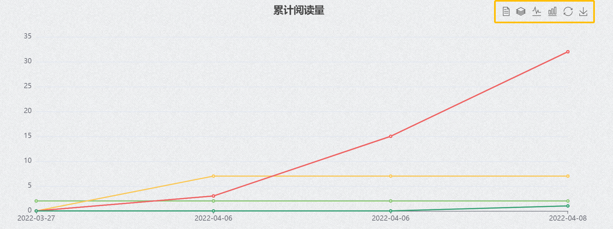
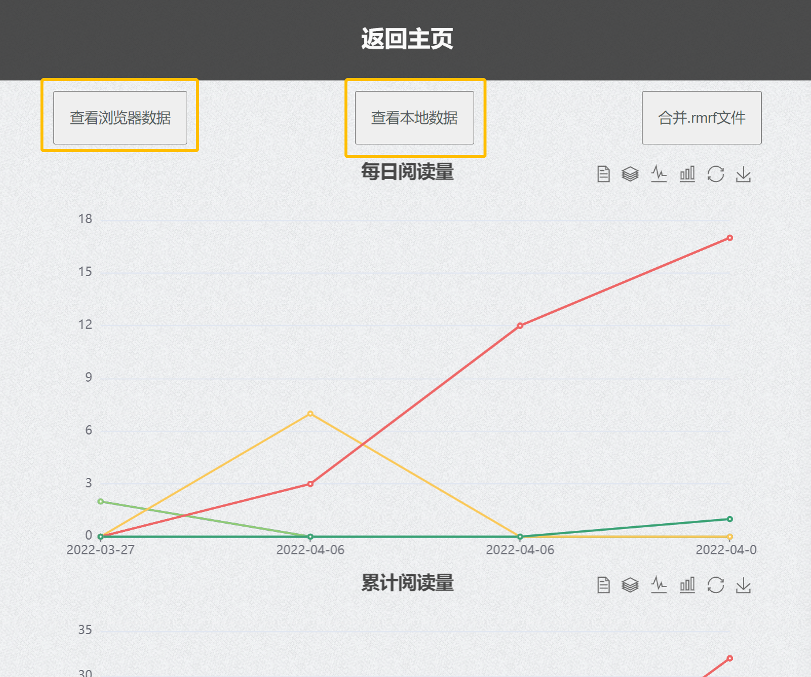
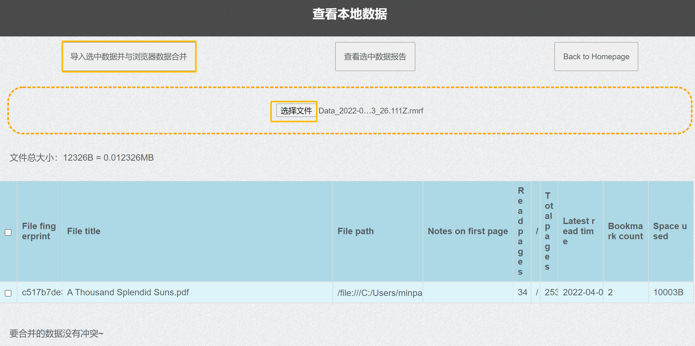

# ReadingMap使用手册

## 摘要：什么是ReadingMap？
ReadingMap是一个拥有**多功能进度条**的pdf浏览插件。如下图所示：

图中左侧白绿交加的竖条，就是我们所说的“多功能进度条”了。

#### 这根“多功能进度条”有哪些功能呢？

1. ##### 可视化阅读进度。
   
   在进度条中，白色区域代表这个文档中你还没有读过的页面；浅绿色的区域代表你读过一两遍的页面；深绿色的区域代表你反复翻阅过的页面。
   （注：用什么颜色表示读的次数，以及读几次颜色才会涂到最深，你都可以按喜好调节。详见[具体上色操作](#changeColorbar)）
   你可以在期末复习的时候，根据课程幻灯片上的进度条颜色，回忆有哪些页面是自己因为上课走神从来没有看过的；
   你可以在翻书的时候从容向前跳转，而不会因为忘记“我刚刚看到哪儿了来着？”而漏掉中间的知识点；
   你还可以通过围观大神的进度条，看看有哪些页面是大神反复翻阅琢磨过的，那里一定有课程的重点难点；
   你也可以借助“我一定要把整根进度条涂绿！”的执念，鼓励自己好好复习……
   
2. ##### 添加书签与文字注记。
   
   在多功能进度条中，有一个黄色的圆点。这是一个“书签”——你可以根据你自己的需要，在任意页面上标记书签。（如果你觉得这个黄色圆点不好看，你也可以将它替换为其他图形——比如说卡通人物头像。详见[换mark操作](#changeMark)。）
   你也可以在每一页上添加一段文字注记。你可以通过切换注记显示模式，在进度条上显示所有注记，直观地看到“你在什么地方评论了什么”。
   
3. ##### 精准跳转。
   
   你可以点击多功能进度条的任意位置（例如一个书签，或者一块深绿色的重点区域），直接跳转到对应的页面，实现精准空降。

#### 围绕着这根进度条，我们还实现了一些其他功能：

1. ##### 阅读量统计
   
   ReadingMap收集了这么多数据，自然也可以完成一些统计工作。例如说，你可以在统计页面查看自己每天读了多少页pdf：
   
   你可以从这些数据中回顾你这一周都干了些什么，~~并且用截图发朋友圈~~。
2. ##### 数据的导入、导出、合并
   
   ReadingMap是一款浏览器插件，你的阅读数据存储在你浏览器的本地数据库里。你可以通过导出功能另存你的阅读数据，或是用合并功能合并不同设备上的阅读记录。如果你打算深度使用ReadingMap，强烈建议你仔细阅读使用手册中的[数据管理](#dataManagement)一节。
   （此外，ReadingMap导出的.rmrf格式文件中是一个明文存储的JSON对象，如果你正在学习入门python，“分析自己的ReadingMap数据”也许会是一个不错的练手项目。）

**另外，在详细介绍如何使用ReadingMap之前，我们想先自吹自擂几个ReadingMap的优点：**

1. ##### 轻量、简洁，不打扰
   
   轻量：ReadingMap依托于浏览器的渲染功能，全部功能内容只有几MB（TODO：填入真实值）。在你下载的压缩包里，主要占空间的其实只有这篇图文并茂的使用手册。
   简洁：ReadingMap只占用了屏幕左侧一根多功能进度条的空间来展示信息。
   不打扰：ReadingMap里既没有视频推送流，也没有社区分享圈，更没有贴片广告，争取不对你的学习产生打扰。
   
2. ##### 开源、免费、透明
   
   开源：我们的代码是开源的。
   免费：我们的代码是免费的。
   透明：你所有的数据都明文存储在本地，你可以随时清除，或是自行导出分析。
   
3. ##### 网络资源也能用
   
   除了你已经下载下来的本地pdf可以用ReadingMap追踪阅读数据，你在网上（例如说arXiv，或者是教学网）上预览的pdf也能用！
   
   

如果你读完这段介绍对使用ReadingMap感兴趣，你可以接着阅读详细的[安装指南](#howtoEquip)与[使用说明](#howtoUse)：

## 环境与安装指南

经我们测试，ReadingMap能在**Google Chrome**与**Microsoft Edge**环境中运行。它在其他基于Chromium内核的浏览器应该也能相应地适配。

因为一些技术原因，ReadingMap尚未上线Chrome应用商城/Edge应用商城。你可以通过下载源代码的方式安装这个插件。

### 下载
我们的项目主页是https://github.com/HYLZ-2019/ReadingMap。如果你会使用git，你可以直接把整个仓库clone下来。如果你不会，你可以在主页上点击“Code”——点击“Download ZIP”，下载压缩包并解压：

   

### 安装
#### Chrome
如果你使用的浏览器是Google Chrome，安装步骤包括：
1. 打开Chrome浏览器扩展。

   > 有两种方法：
   >
   > * 点击“扩展”，选择“管理扩展程序”
   > * 点击“菜单”，选择“更多工具”，选择“扩展程序”

   

2. 打开开发者模式。
   
3. 点击“加载已解压的扩展程序”，选择你下载后解压到的文件夹。
  
   
4. 打开新扩展：
   
    (1) 这个界面显示“错误”是正常现象，不影响使用。
    (2) 再点击一次可以暂停使用ReadingMap，这不会影响你已有的数据。但是**点击“移除”进行卸载会不可逆地删除浏览器中存储的所有ReadingMap数据，如果你想卸载，请务必先用导出功能保存你想留下的数据！**
5. 在浏览器中正常地打开pdf文件，就可以使用ReadingMap的功能了。

#### Edge
如果你使用的浏览器是Microsoft Edge，安装步骤包括：
1. 打开Edge浏览器扩展。

   > 有两种方法：
   >
   > * 点击“扩展”，选择“管理扩展”
   > * 点击“菜单”，选择“更多工具”，选择“扩展程序”

   
2. 打开开发者模式。
   
3. 点击“加载已解压的扩展程序”，选择你下载后解压到的文件夹。
   
   
4. 打开新扩展：
   
    (1) 这个界面显示“错误”是正常现象，不影响使用。
    (2) 再点击一次可以暂停使用ReadingMap，这不会影响你已有的数据。但是**点击“删除”进行卸载会不可逆地删除浏览器中存储的所有ReadingMap数据，如果你想卸载，请务必先用导出功能保存你想留下的数据！**
5. 在浏览器中正常地打开pdf文件，就可以使用ReadingMap的功能了。

### 使用
在浏览器中正常地打开pdf文件，就可以使用ReadingMap的功能了。

### 使用说明

#### 基本功能：阅读情况可视化及统计（不用任何操作）

将你要看的PDF拖动到浏览器最上栏（即用浏览器打开），然后正常阅读【朴素】

##### 阅读时间可视化（左边栏）

* 在阅读一段时间后，左侧栏就会显示颜色，多次阅读默认颜色加深；如果你不喜欢默认颜色，在插件选项中，选中ReadingMap，修改`options`(或固定后直接选择`Options`)，进行色彩自定义

    

    

* 可以调整页面停留时间，色阶数量以及每个色块的颜色；在选定两端颜色后可以通过重设色阶数目进行平滑；点击`Save Settings`保存，刷新一下就可以啦

  

      
  

* 奇怪但自由的色阶定义$\downarrow$

  

      
  

##### 跳转

你可以点击多功能进度条的任意位置（例如一个书签，或者一块深绿色的重点区域），直接跳转到对应的页面，实现精准空降

##### 书签显示

* 当你看到想标注一下的地方，点击左上角`五角星`按钮即可加书签；再按取消书签

  

      
  

##### 添加注记

* 有想要记下的只字片语，请点击左上角`对话框`按钮，在输入框里删改注记，全部删除后默认取消

  

      
  

##### 显示/关闭摘要并在注记中搜索关键词

* 你可以自由选择是否显示摘要，显示带书签标记的摘要以及不显示摘要

* 同时我们支持搜索注记中关键词，达到一键定位

  

      
  

##### 更换书签标记

* 打开压缩包解压后的文件夹

* 按以下路径找到`小黄-defaultMarker`：ReadingMap/rmImages/markers/defaultMarker.png

* 在该文件夹中保存待替换的图象，例`Marker.png`

* 按以下路径找到对应css文件：ReadingMap/content/web/readingMap.css

* 将`.rmMarker`对应位置改为要替换的图象文件名

  

      
  

  

  可调整height/left控制标记位置大小，效果如下：

  

      
  

#### 深度使用：数据管理

##### 阅读量统计

* 选中`Manage Data`即可查看近期阅读数据：每日阅读量、累计阅读量

	

* 可在右上角自由切换视图

	    

##### 浏览记录的下载合并及同步

主要分为两种数据——浏览器数据与本地数据（先前保存的.rmrf格式文件），可以下载浏览器数据，导入本地数据，进行数据的合并以及查看选中数据报告

从上文”阅读量统计“页面，通过`查看浏览器数据`、`查看本地数据`进入浏览器数据和本地数据视图

	

##### 浏览器数据

* 选中数据下载
* 选中数据删除
* 选中多个数据生成上文类似阅读报告

	

##### 本地数据

* 在选择文件中选中待导入的数据，导入后若没有冲突，在页面最下端选择`confirm to merge`

* 若导入时产生冲突，即存在对于同一个PDF的矛盾数据，可选择解决冲突方式，在`Merge Mode`中选择`overwrite/add`，在页面最下端选择`confirm to merge`

* > overwrite：蓝色部分覆盖黄色部分
  >
  > add：蓝色部分添加

  

  	
  

* 注意：一次仅导入一个文件，一个文件可包含多个PDF条目

	

##### 合并数据

* 选择两个.rmrf文件导入数据，若两个文件存在对于同一个PDF的矛盾数据，可选择解决冲突方式，在`Merge Mode`中选择`overwrite/add`

* > overwrite：蓝色部分覆盖黄色部分
  >
  > add：蓝色部分添加

* 完成后，选择`Confirm to Merge`自动下载合并后数据，可重新导入浏览器

##### 浏览器与本地界面的阅读量统计

* 均可勾选方框，查看选中数据报告

