# ReadingMap使用手册

## 摘要：什么是ReadingMap？
ReadingMap是一个拥有**多功能进度条**的pdf浏览插件。如下图所示：

图中左侧白绿交加的竖条，就是我们所说的“多功能进度条”了。

#### 这根“多功能进度条”有哪些功能呢？

1. ##### 可视化阅读进度。
   
   在进度条中，白色区域代表这个文档中你还没有读过的页面；浅绿色的区域代表你读过一两遍的页面；深绿色的区域代表你反复翻阅过的页面。
   （注：用什么颜色表示读的次数，以及读几次颜色才会涂到最深，你都可以按喜好调节。详见[具体上色操作](#changeColorbar)）
   你可以在期末复习的时候，根据课程幻灯片上的进度条颜色，回忆有哪些页面是自己因为上课走神从来没有看过的；
   你可以在翻书的时候从容向前跳转，而不会因为忘记“我刚刚看到哪儿了来着？”而漏掉中间的知识点；
   你还可以通过围观大神的进度条，看看有哪些页面是大神反复翻阅琢磨过的，那里一定有课程的重点难点；
   你也可以借助“我一定要把整根进度条涂绿！”的执念，鼓励自己好好复习……
   
2. ##### 添加书签与文字注记。
   
   在多功能进度条中，有一个黄色的圆点。这是一个“书签”——你可以根据你自己的需要，在任意页面上标记书签。（如果你觉得这个黄色圆点不好看，你也可以将它替换为其他图形——比如说卡通人物头像。详见[换mark操作](#changeMark)。）
   你也可以在每一页上添加一段文字注记。你可以通过切换注记显示模式，在进度条上显示所有注记，直观地看到“你在什么地方评论了什么”。
   
3. ##### 精准跳转。
   
   你可以点击多功能进度条的任意位置（例如一个书签，或者一块深绿色的重点区域），直接跳转到对应的页面，实现精准空降。

#### 围绕着这根进度条，我们还实现了一些其他功能：

1. ##### 阅读量统计
   
   ReadingMap收集了这么多数据，自然也可以完成一些统计工作。例如说，你可以在统计页面查看自己每天读了多少页pdf：
   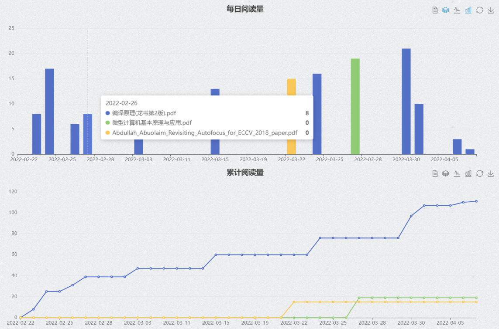
   你可以从这些数据中回顾你这一周都干了些什么，~~并且用截图发朋友圈~~。
2. ##### 数据的导入、导出、合并
   
   ReadingMap是一款浏览器插件，你的阅读数据存储在你浏览器的本地数据库里。你可以通过导出功能另存你的阅读数据，或是用合并功能合并不同设备上的阅读记录。如果你打算深度使用ReadingMap，强烈建议你仔细阅读使用手册中的[数据管理](#dataManagement)一节。
   （此外，ReadingMap导出的.rmrf格式文件中是一个明文存储的JSON对象，如果你正在学习入门python，“分析自己的ReadingMap数据”也许会是一个不错的练手项目。）

**另外，在详细介绍如何使用ReadingMap之前，我们想先自吹自擂几个ReadingMap的优点：**

1. ##### 轻量、简洁，不打扰
   
   轻量：ReadingMap依托于浏览器的渲染功能，全部功能内容只有几MB（TODO：填入真实值）。在你下载的压缩包里，主要占空间的其实只有这篇图文并茂的使用手册。
   简洁：ReadingMap只占用了屏幕左侧一根多功能进度条的空间来展示信息。
   不打扰：ReadingMap里既没有视频推送流，也没有社区分享圈，更没有贴片广告，争取不对你的学习产生打扰。
   
2. ##### 开源、免费、透明
   
   开源：我们的代码是开源的。
   免费：我们的代码是免费的。
   透明：你所有的数据都明文存储在本地，你可以随时清除，或是自行导出分析。
   
3. ##### 网络资源也能用
   
   除了你已经下载下来的本地pdf可以用ReadingMap追踪阅读数据，你在网上（例如说arXiv，或者是教学网）上预览的pdf也能用！
   
   

如果你读完这段介绍对使用ReadingMap感兴趣，你可以接着阅读详细的[安装指南](#howtoEquip)与[使用说明](#howtoUse)：

## 环境与安装指南

经我们测试，ReadingMap能在**Google Chrome**与**Microsoft Edge**环境中运行。它在其他基于Chromium内核的浏览器应该也能相应地适配。

因为一些技术原因，ReadingMap尚未上线Chrome应用商城/Edge应用商城。你可以通过下载源代码的方式安装这个插件。

### 下载
我们的项目主页是https://github.com/HYLZ-2019/ReadingMap 。如果你会使用git，你可以直接把整个仓库clone下来。如果你不会，你可以在主页上点击“Code”——点击“Download ZIP”，下载压缩包并解压：

   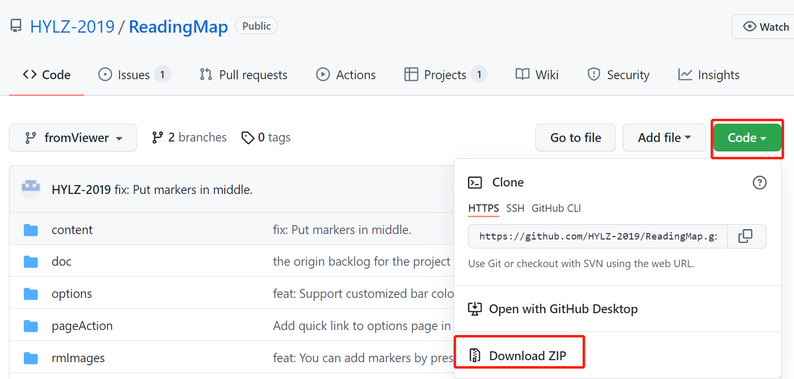

### 安装
#### Chrome
如果你使用的浏览器是Google Chrome，安装步骤包括：
1. 打开Chrome浏览器扩展。

   > 有两种方法：
   >
   > * 点击“扩展”，选择“管理扩展程序”
   > * 点击“菜单”，选择“更多工具”，选择“扩展程序”

   

2. 打开开发者模式。
   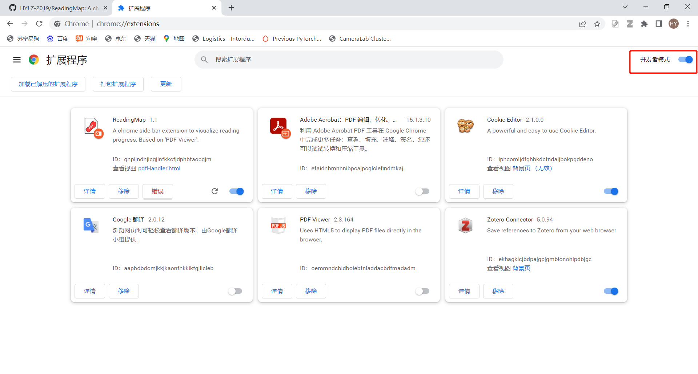
3. 点击“加载已解压的扩展程序”，选择你下载后解压到的文件夹。
  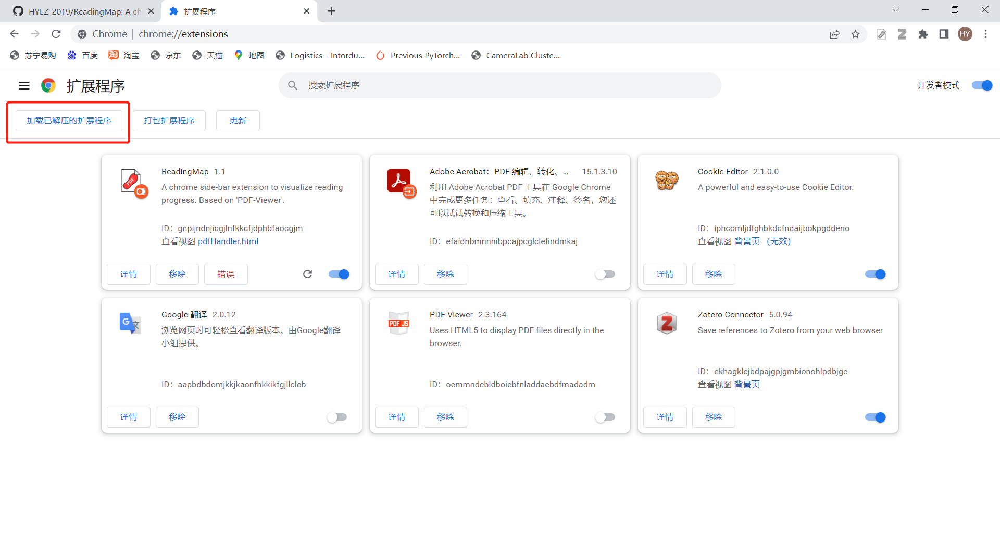
   
4. 打开新扩展：
   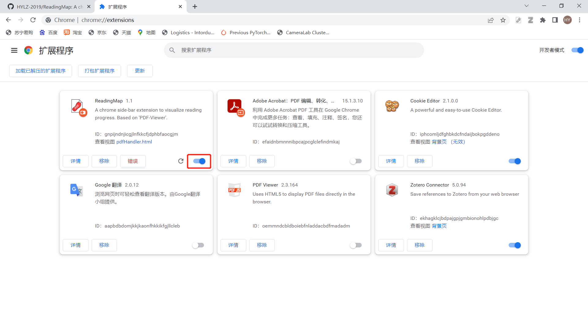
    (1) 这个界面显示“错误”是正常现象，不影响使用。
    (2) 再点击一次可以暂停使用ReadingMap，这不会影响你已有的数据。但是**点击“移除”进行卸载会不可逆地删除浏览器中存储的所有ReadingMap数据，如果你想卸载，请务必先用导出功能保存你想留下的数据！**
5. 在浏览器中正常地打开pdf文件，就可以使用ReadingMap的功能了。

#### Edge
如果你使用的浏览器是Microsoft Edge，安装步骤包括：
1. 打开Edge浏览器扩展。

   > 有两种方法：
   >
   > * 点击“扩展”，选择“管理扩展”
   > * 点击“菜单”，选择“更多工具”，选择“扩展程序”

   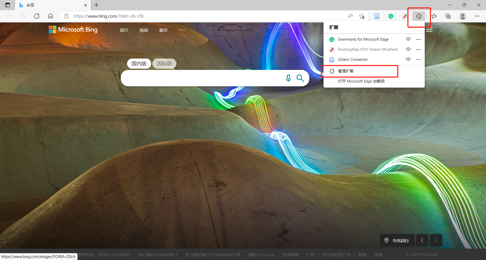
2. 打开开发者模式。
   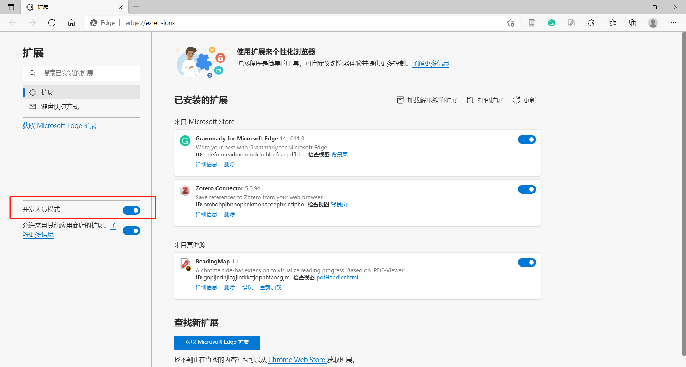
3. 点击“加载已解压的扩展程序”，选择你下载后解压到的文件夹。
   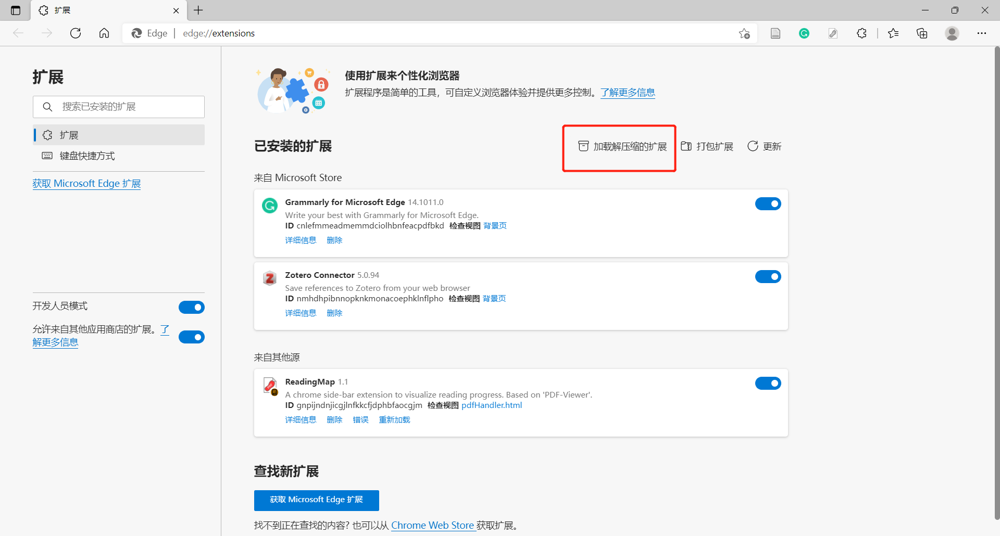
   
4. 打开新扩展：
   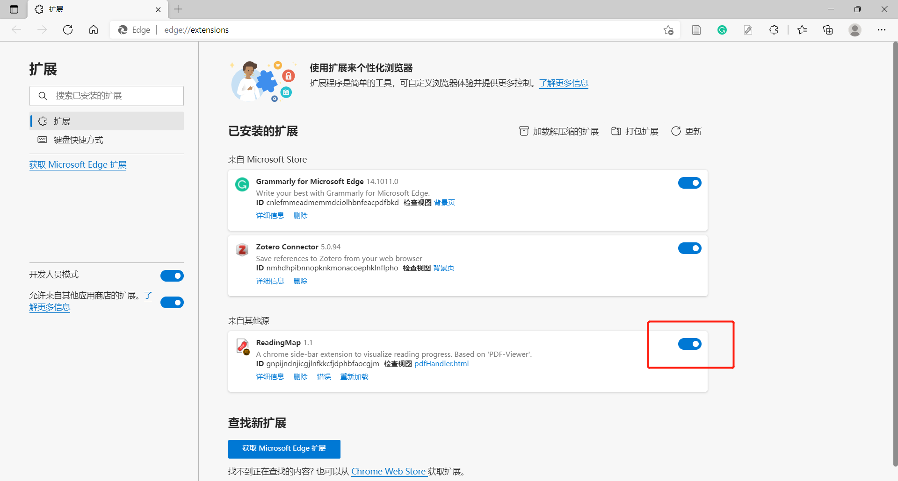
    (1) 这个界面显示“错误”是正常现象，不影响使用。
    (2) 再点击一次可以暂停使用ReadingMap，这不会影响你已有的数据。但是**点击“删除”进行卸载会不可逆地删除浏览器中存储的所有ReadingMap数据，如果你想卸载，请务必先用导出功能保存你想留下的数据！**
5. 在浏览器中正常地打开pdf文件，就可以使用ReadingMap的功能了。

### 使用
在浏览器中正常地打开pdf文件，就可以使用ReadingMap的功能了。

## 使用说明

### 基本功能

不需要任何多余操作，在浏览器中正常地打开pdf文件即可。

如果你想快捷地使用阅读日报等功能，可以将ReadingMap固定在你的浏览器工具栏里：

    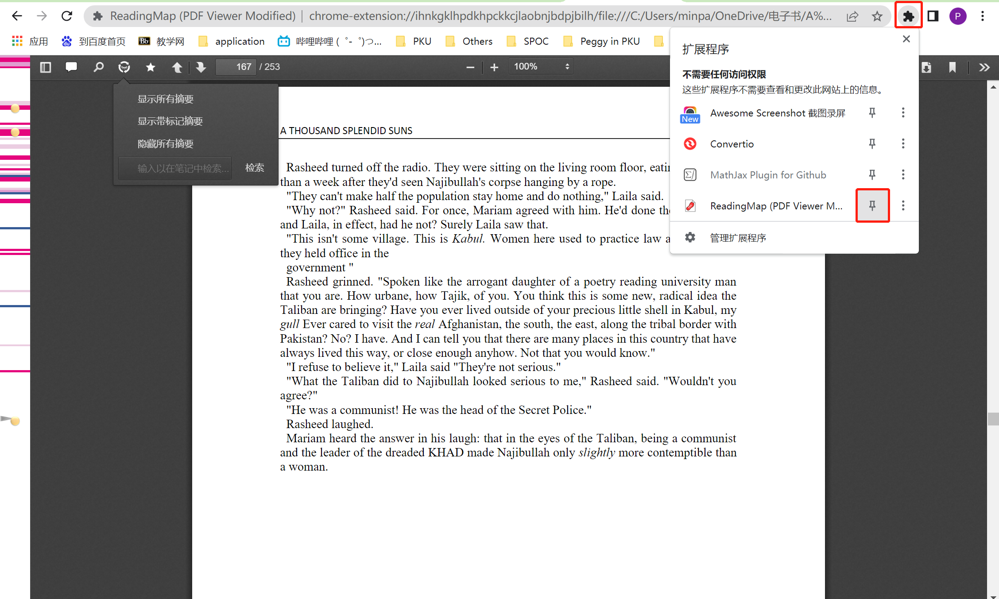

固定后，你就可以点击ReadingMap的图标打开弹窗界面。弹窗界面中包括阅读日报（你今天已经读了哪些pdf，分别新读了几页）、通往设置页面的链接，和通往数据管理统计页面的链接。

    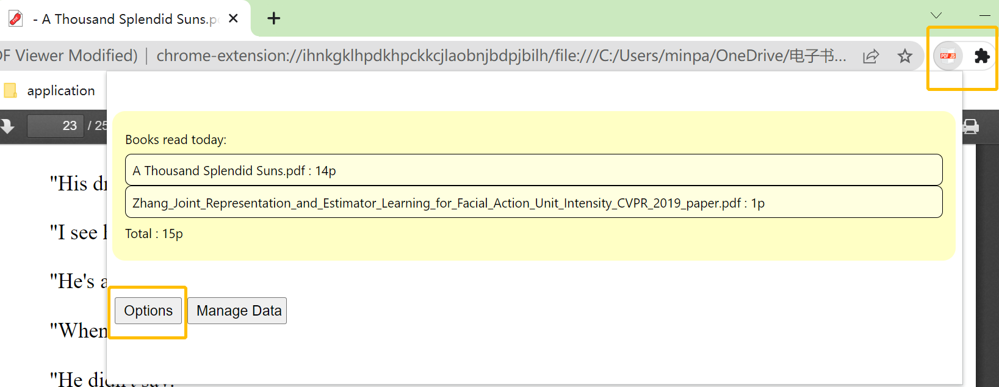

##### 书签显示

* 当你看到想标注一下的地方，点击左上角`五角星`按钮即可加书签；再次点击可以取消书签。

  

      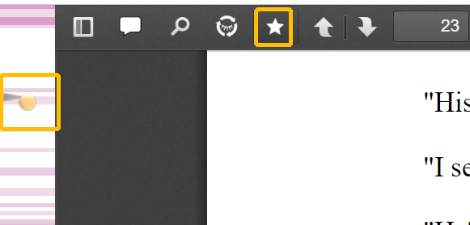
  

##### 添加注记

* 有想要记下的只字片语，请点击左上角`对话框`按钮，在输入框里删改注记。（修改文字后，要在框外任意点击一下，才会保存。）

  

      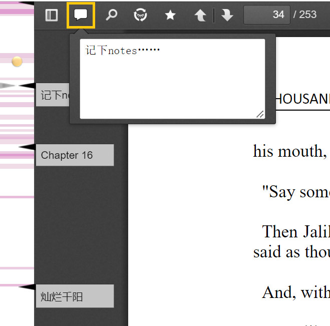
  

##### 显示/关闭摘要并在注记中搜索关键词

* ReadingMap提供了三种在多功能进度条上显示摘要的模式：（1）显示所有的摘要；（2）只显示有书签的页面上的摘要；（3）不显示摘要。你可以点击模式切换键选择你想要的显示模式。

* 同时我们支持搜索注记中的关键词。点击“检索”，所有注记中包含搜索关键词的页面的摘要都会显示出来。

  

      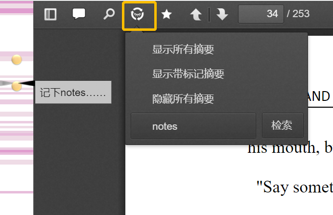
  

##### 跳转

你可以点击多功能进度条的任意位置（例如一个书签，或者一块深绿色的重点区域），直接跳转到对应的页面，实现精准空降。

### 自定义设置
你可以通过多种方式进入设置页面：
1. 如果你把ReadingMap固定到了浏览器工具栏上，你可以直接点击ReadingMap图标——点击“设置”，进入设置页面。
2. 如果你没有固定，你可以点击“扩展”——“ReadingMap”打开Readingmap弹窗，然后点击“设置”进入设置页面。
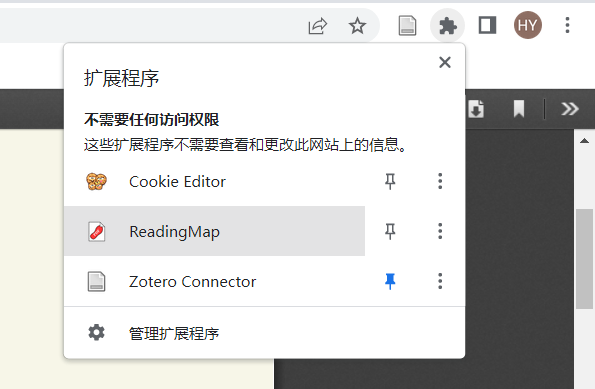

设置页面中的可选项包括：
#### 自定义颜色
在阅读一段时间后，ReadingMap的多功能进度条就会显示颜色。默认的设置是随着阅读次数增加，颜色由白变绿。如果你不喜欢默认颜色，你可以自定义颜色配置：

  

      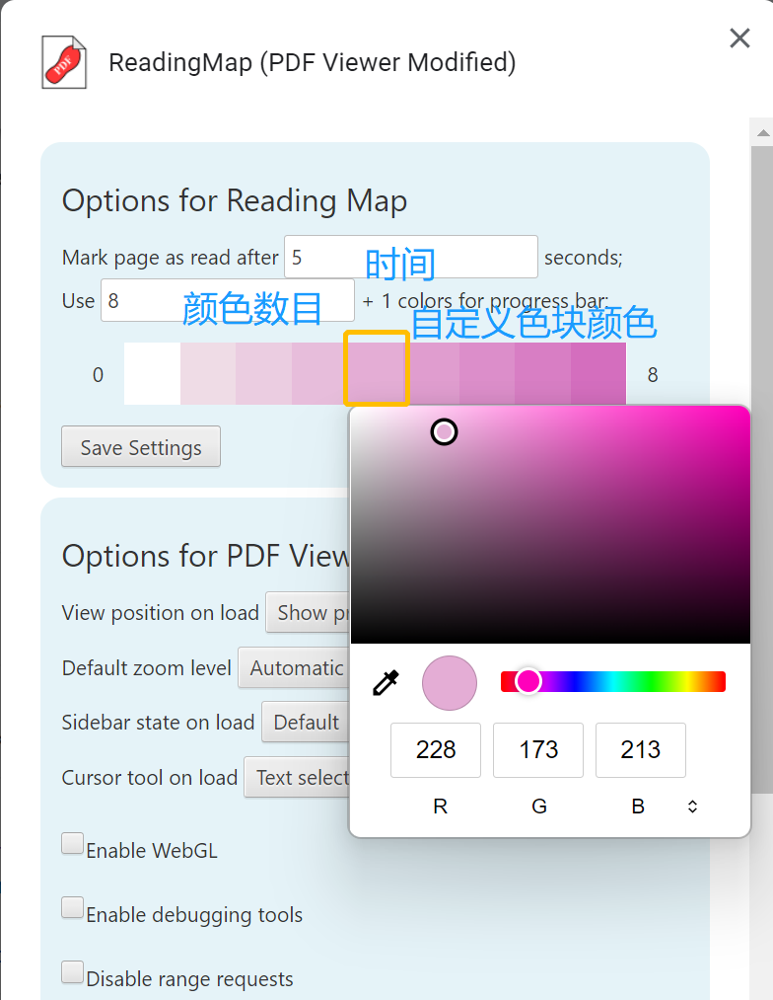
  

* 你可以更改“颜色数目”来调节总共用几种颜色表示阅读次数。例如说，如果你将颜色数目设为3，那么设置页面里会出现四个色块，它们由左到右分别代表读了0次、1次、2次、>=3次的页面的颜色。
* 你可以点击任意一个色块，改变它的颜色。
* 在选定两端颜色后，你可以再次修改颜色数目，ReadingMap会自动线性插值填充中间的颜色。

修改完毕后，点击`Save Settings`保存，刷新一下即可。

* 奇怪但自由的色阶定义$\downarrow$

  

      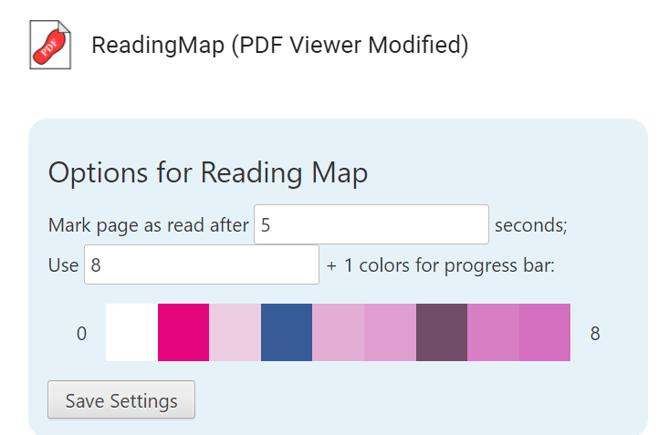
  

#### 自定义阅读时间阈值
ReadingMap对于“读了一页一次”的判定方法是这样的：如果你在翻页之前，在第X页停留了超过T秒，就记为你读了第X页一次。

你可以通过修改“时间”来改变T秒这个阈值。

#### 更换书签标记

* 打开压缩包解压后的文件夹

* 按以下路径找到`小黄-defaultMarker`：ReadingMap/rmImages/markers/defaultMarker.png

* 在该文件夹中保存待替换的图象，例`Marker.png`

* 按以下路径找到对应css文件：ReadingMap/content/web/readingMap.css

* 将`.rmMarker`对应位置改为要替换的图象文件名

  

      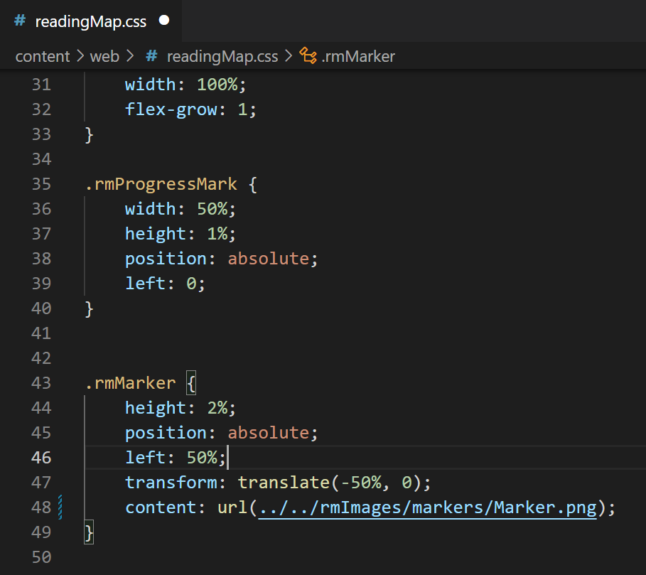
  

  

  可调整height/left控制标记位置大小，效果如下：

  

      
  

### 数据管理

* 点击`数据管理器`即可进入数据管理界面。

	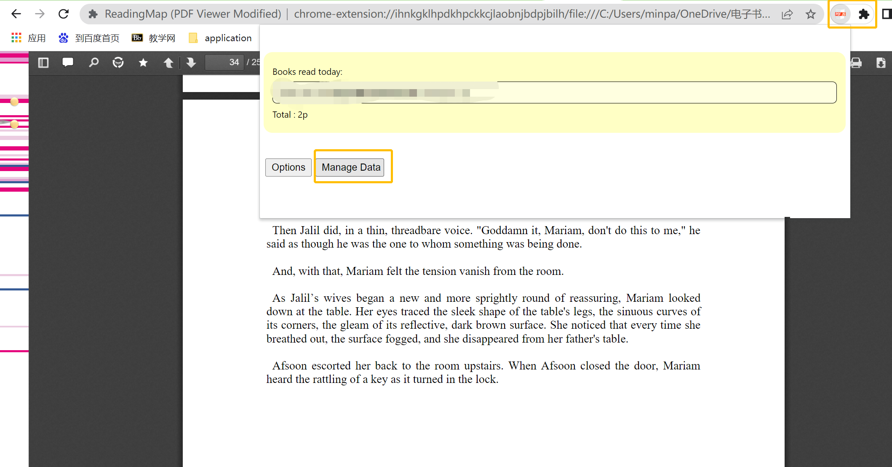

在数据管理器中，你可以操作两种数据：浏览器数据（阅读产生的新鲜数据，通过浏览器的localStorage API储存）与本地数据（先前保存的.rmrf格式文件）。你可以导出浏览器数据、导入本地数据、进行数据的合并或者查看选中数据的阅读报告。

从上文“数据管理器”页面，通过`查看浏览器数据`、`查看本地数据`可以进入浏览器数据和本地数据视图。

#### 关于浏览器存储限制
ReadingMap在浏览器中存储数据依靠浏览器本身提供的localStorage API。这个API只提供5MB的存储空间，超出以后，新数据将无法记录。在空

#### 阅读量统计

数据管理界面的首页会根据当前浏览器中数据生成阅读报告。在浏览器数据视图、本地数据视图中，你也可以生成阅读报告图表。

在每日阅读量的统计图表中，你可以取消“堆叠”、“柱状图”，直观地看出每天读了多少什么内容：

在总阅读量的统计图表中，你可以点击“折线图”，直观地看出每本书阅读进度随时间的变化。
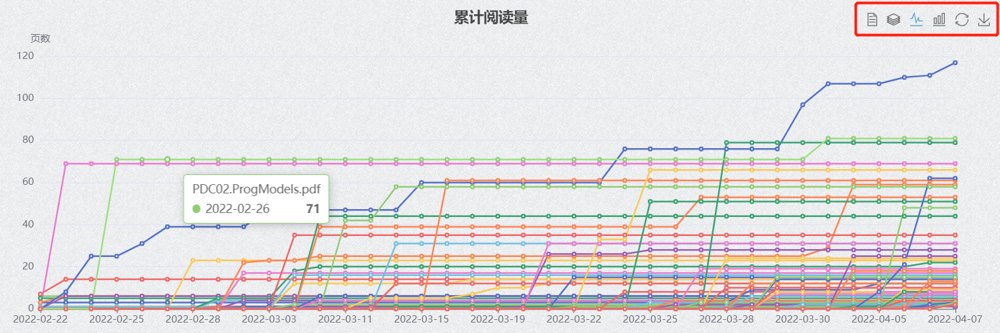
#### 浏览器数据
在浏览器数据视图中，你可以勾选部分pdf文档，然后：
* 点击“导出选中数据并下载”，下载有关数据；
  * 你会得到一个.rmrf格式的文件。
* 点击“从浏览器中删除选中的数据”，将它们删除；
  * 浏览器中有关这些pdf具体页码的数据（包括每一页读了几次、上面的注记等）都会被删除，建议先导出备份再清理。不过，阅读历史中关于它们的信息（例如你哪天读了它10页）不会被删除。
* 点击“查看选中数据报告”，生成类似主页的历史图表。

	

#### 本地数据

在本地数据视图中，你需要先点击“选择文件”，选择你要打开的.rmrf格式文件。

随后，你可以选择这个文件中你需要的条目：

* 点击“导入选中数据并与浏览器数据合并”，将这些数据导入浏览器；
* 点击“查看选中数据报告”，生成类似主页的历史图表。

需要注意的是，“合并”可能需要处理冲突，详见[处理文件冲突](#处理文件冲突)。

#### 合并.rmrf文件

ReadingMap还提供了合并.rmrf文件的功能。在合并页面中，你可以上传两个.rmrf文件。在处理冲突后，你可以下载合并得到的新.rmrf文件。冲突处理详见[处理文件冲突](#处理文件冲突)。

#### 处理文件冲突

“冲突”指的是两个.rmrf同时包含关于某份pdf的数据的情况。例如说，如果“backup.rmrf”中记载`ICS.pdf`的第1页读了3次，而“new_backup.rmrf”中记载`ICS.pdf`的第1页读了5次，就会产生冲突。

ReadingMap提供了两种解决冲突的合并模式：

1. 覆盖（Overwrite）。如果要用覆盖模式合并两条pdf记录，ReadingMap会选择导出时间比较新的那条记录，然后采用它的数据。例如说，如果“new_backup.rmrf”的导出时间比“backup.rmrf”晚，那么ReadingMap会在生成的合并文件里记载“`ICS.pdf`的第1页读了5次”。覆盖模式适合用来处理重复导出导致的冲突。
2. 加和（Add）。如果要用加和模式合并两条pdf记录，ReadingMap会将两条记录的数据相加。在上面的这个例子里，ReadingMap会在生成的合并文件里记载“`ICS.pdf`的第1页读了8次”。加和模式适合用来处理在不同设备上同时阅读、最后导出合并时产生的冲突。

在检测到冲突后，ReadingMap会给出一个表格，罗列所有的冲突情况。你可以点击“合并模式”列中的图标，改变处理每个冲突时想使用的合并模式。（合并模式的默认值由ReadingMap智能推荐，一般来说你不需要手动修改。）

  

  	
  

拉到底部，点击“确认合并”即可完成合并。
