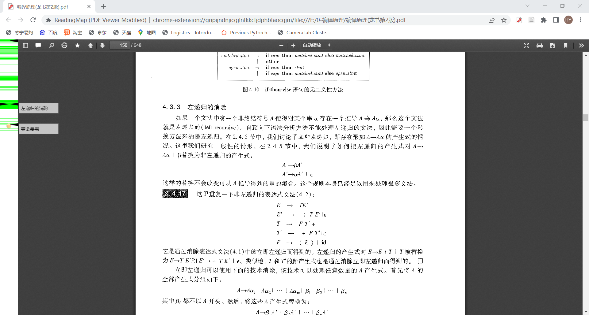
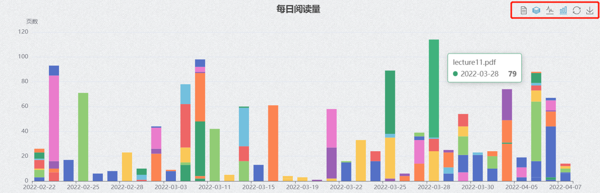
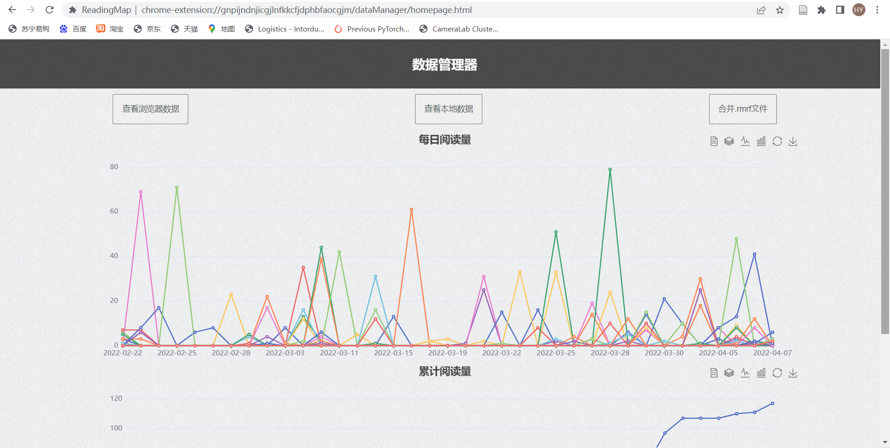
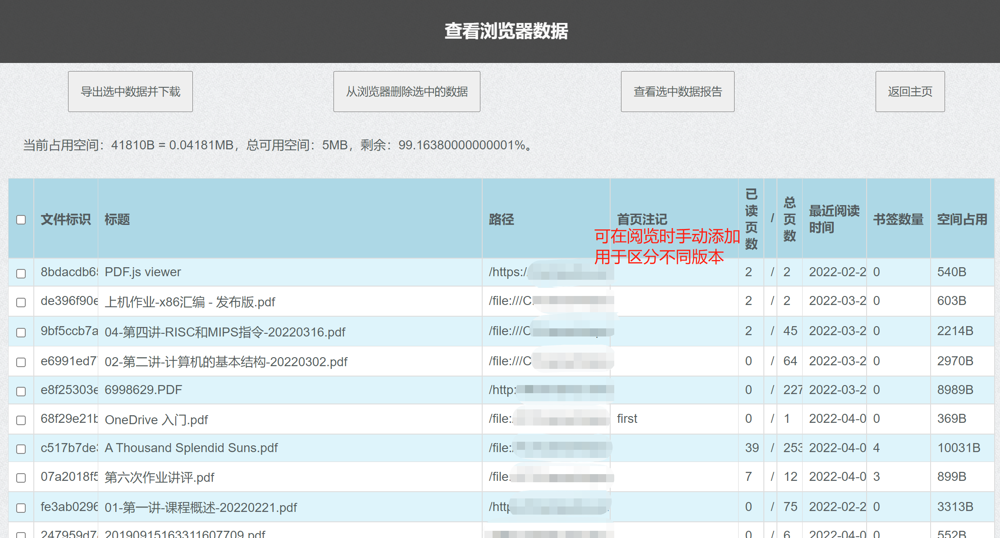
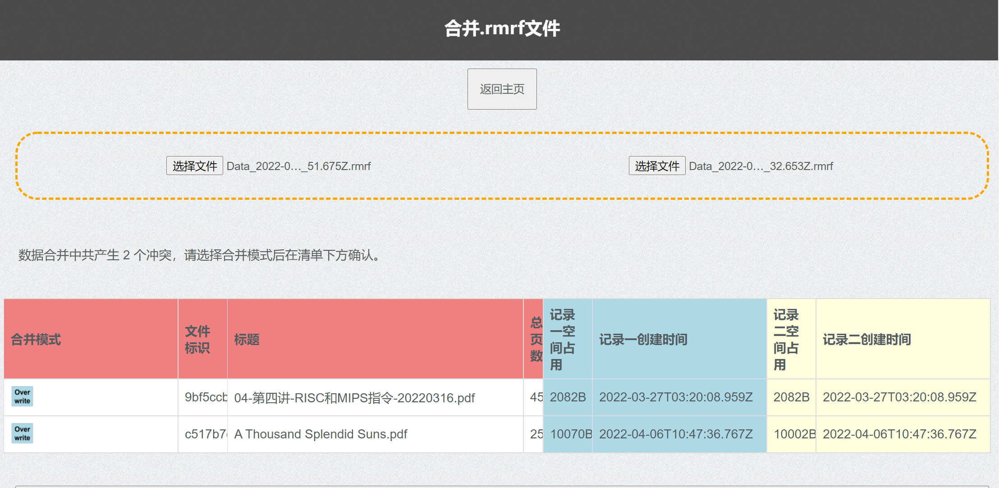

## ReadingMap: 一款通过行为数据可视化辅助pdf阅读的插件

###  摘要
在本项目中，本团队开发了一款名为ReadingMap的浏览器插件，用于通过行为数据可视化辅助pdf阅读。本文主要介绍ReadingMap的开发动机、开发过程与开发者的思考，建议您在阅读本文前先阅读产品介绍：`README.md`。

### 一、用户诉求 & 必要性分析

开发ReadingMap的灵感来自我们阅读纸质教科书时的体验。我们偶然地意识到，在阅读纸质书的过程中，我们的行为模式会在书籍上留下许多痕迹——例如说，如果某一页经常被翻阅，它就会因为产生了褶皱而特别容易被翻到——而在阅读电子书时，我们则往往是“干干净净地来，干干净净地走”。如果能在阅读电子书的过程中记录下阅读行为数据，也许就可以给读者提供辅助信息，带来更好的阅读体验。

我们设想的阅读数据利用方式包括：
1. 通过可视化的“进度条”，鼓励读者继续阅读长篇材料；
2. 通过可视化各个页面被阅读的次数，揭示出材料中的重点、难点；
3. 通过统计阅读量，帮助读者回顾近期阅读行为。
…………

#### 1、问卷调查分析

为了了解对这些功能的诉求是否普遍存在、开发适用于尽可能多用户的产品，我们在线上发布了调查问卷：https://www.wjx.cn/vj/wFVhkbI.aspx。截至开始开发前，我们总共收到了84份有效问卷。

**问卷结果分析如下：**

1. 用电脑端浏览器阅读pdf的潜在用户群体规模较大。

在问卷调查中，91.67%的受访者表示，PDF格式的电子材料占据其总阅读时间的30%以上。78.57%的用户在电脑端阅读，在常用电脑端的用户中，常用Google Chrome和Microsoft Edge阅读pdf文件的用户占比高达60.61%和45.45%。
因此，我们选择将插件搭建在Chrome、Edge浏览器上。由于96%的受访者均未在浏览器上安装与pdf浏览相关的插件（与其他插件竞品的比较见后），ReadingMap的市场潜力较大。

2. 用户诉求

受访者主要功能诉求包含，在浏览PDF的过程中：1. 搜索关键词；2. 书签页导航；3. 记录阅读进度；4. 构建批注；5. 勾划重点；6. 构建思维导图；7. 统计经常浏览页面；8. 合并修改PDF内容等；

同时，82%的受访者表示在阅读长篇材料后，无法定位未阅读的和重难点位置。50%以上的受访者表示，随着阅读材料增加，在快速跳跃阅读后，很难找到没有认真阅读的部分。30%的受访者希望能够有更有反馈更有动力的阅读方式。并且，62%的受访者希望在进度条上可视化书签，38%受访者表示希望浏览PDF时，可以保留最近阅读时间便于定向温故。

#### 2、功能模块设计

针对上述受访者需求，在去除了过于复杂，难以有比较标准实用的设计框架的功能（合并修改PDF，构建思维导图）后，我们将其余功能汇总为三个功能模块：阅读情况可视化及统计、书签标记搜索、浏览记录的下载合并及同步。

1. 阅读情况可视化及统计：主要满足用户对于记录阅读进度，统计经常浏览页面的诉求；解决“长篇阅读后，无法找到何处没有读过”、“难以定位重难点”等问题；给予阅读过程实时反馈，让读者能够有实际的成就感，在阅读中有更加强的动力。同时，该模块支持根据阅读数据生成报告，便于读者观察自身阅读情况。

2. 书签注记搜索：主要满足用户对于“书签页导航”、构建批注、搜索批注内容定位文本的需求；解决“难以定位重难点”、“无法找到自己的批注内容”等问题，最大的亮点是针对大部分用户对于“希望能够在自己的批注中查找关键词”的诉求，强化了对重难点的灵活定位，让用户可以用主观批注与客观阅读进度相结合的方式，更加全面地掌握阅读材料的情况。

3. 浏览记录的下载合并及同步：本模块支持用户自行管理浏览记录数据，允许在多个用户，多个设备和浏览器间，按自身需求手动导出和导入。同时，本模块支持灵活的阅读记录合并和不同的合并方式，让用户可以通过导入其他人的阅读记录来获取别人对阅读材料的分析和理解难点，也可以导出自己的记录进行分享和保存。

 

### 二、功能简述 

ReadingMap具备以下功能：

1、可视化阅读进度：通过颜色标识已读、读过多次页面

2、阅读量统计：根据用户数据，查看每日阅读量、累计阅读量的图像化表示

3、添加书签与文字注记：根据需要，在页面上标记书签，添加文字注记

4、精准跳转：点击多功能进度条任意位置跳转页面

5、数据的导入、导出与合并

### 三、使用描述

（详见README.md文件，包含安装指南与使用说明）

图1 PDF阅读界面（左侧栏显示，书签/注记/显示摘要/检索摘要）

图2、3 阅读量统计可视化界面

图4 浏览器数据界面

  

图5 合并文件时解决冲突界面

### 四、测试、安全与开发技术

作为一个合格的软件，完整的开发流程，完备的测试和可靠的安全性无疑是非常重要的，我们的开发团队也在开发过程和后续整理过程中进行了持续的测试和安全性排查。

#### 1、完整的开发流程 ####

我们最根本的目标是希望设计一款高度契合用户需求，易用实用的软件，所以我们在开发中主要遵循敏捷开发的开发模式，并采用了面向对象和结构化的方法，并个性化加入了实时的用户反馈以此来保证最大限度的契合和灵活性。

基于敏捷开发流程，我们软件的更新迭代整体而言是速度较快，效率较高的，实时的需求更新和问题发现使得我们能够在短时间内目标明确的完成更多的任务。但是，开发团队前期的不够成熟的设计和规划也使得我们在开发后期增加了重构和更新的代价，不过总体而言都有在最后很好的解决。
面向对象和结构化的设计方法让我们从对象入手规划我们的需求和需要实现的效果，使得目标和任务更加清晰，避免了很多的中间转换环节和多余劳动，加快了软件的开发进程，使得开发过程更有效率也更易分工。同时，面向对象方法使得我们的功能更易扩展，也更加容易进行测试和维护，注重各个对象和函数间的重用性，减少了很多不必要的代码和工作。结构化模式自顶向下设计，使得我们在过程中可以高度契合多变的需求。

我们也根据自身软件的高度面向用户的个性化需求，选择了灵活的看板 + backlog的灵活文档规划方式，并且在开发过程中实时进行用户抽样和反馈收集，根据用户的诉求对开发过程的需求和进程进行了灵活的调整和跟进。在自顶向下设计中，尤其重视软件的扩展性和框架保留，最大限度的保证了开发的灵活性和对用户需求的契合。

#### 2、完备的测试 ####
我们主要着眼于对基础功能和界面的测试，目的为发现在于网络交互中存在的问题和界面之下corner case的安全性和可行性，旨在发现一切漏洞。
首先，我们的开发主要遵循敏捷开发原则，在过程中和结束后都进行了完备的单元测试，针对每个函数进行条件组合覆盖100%的测试，尽量完成全部的路径覆盖和处理。通过多种测试用例，最大限度模仿可能的用户行为，保证足够的边界情况考虑和漏洞捕捉。
之后，在框架基本搭建好之后，进行功能的集成测试，根据当前的功能列表和开发进度进行完整的功能路径操作，用不同种类和体量的数据，在不同的环境中进行每种功能的流程测试。主要包括对三个功能模块的使用模拟，同时通过给开发团队以外的其他用户进行使用，来发现开发团队思维范畴以外的漏洞，总体来说，测试过程比较顺利，除了部分功能的corner case，没有发现影响运行的重大问题，已经反复完善。
同时针对界面接口，我们也反复确认其兼容性，并且在很多方面，例如语言，使用的简单和清晰方面进行了更多的测试和优化，真正达到用户为本，高度契合用户需求的宗旨。同时我们在开发过程中，随时进行版本的更新和保存，使得每一个时间里都有一个可以立即使用的不会崩溃的版本，即使出现问题也可以通过存档迅速解决和回溯，使得测试和开发能够同时进行，同时交付。
总体来说，我认为我们的软件执行情况良好，无已知缺陷，可以进行交付。

#### 3、可靠的安全性 ####
同时，我们对软件安全性进行了详尽的分析和排查。
首先，我们的软件选择了完全的开源开发，最大程度的保证了软件流程的透明，用户可以清晰的了解到整个软件执行的数据流，从根本上保证了安全性。
同时，我们的软件是一个浏览器插件，数据都是本地存储在对应的浏览器缓冲区，没有第三方的数据调用和传输，也不需要用户的身份信息验证，从流程上保证了安全性。
最后，我们支持数据的导入和导出，用户可以不用担心设备迁移或者浏览器迁移导致的数据丢失，同时也因为除了本地没有别的网络残留，也不用担心其他的数据泄露，这也从结果上保证了数据的安全性。
唯一的缺点是，软件数据的可追溯性比较弱，如果用户误删了数据将很难进行恢复，这也将是我们后续的一个版本迭代方向。

总体而言，从软件的开发，测试，安全性排查流程上看，ReadingMap当前执行情况良好，完全具备交付和使用的能力。

TODO(lyw)：测试表格加入

### 五、用户体验（抽样访谈）

在我们的开发过程中，我们一直积极和用户进行沟通交流，从用户处获得了很多反馈，包括初期的用户需求了解，中期版本的人工测试和新需求发现，最后交付后的完整阅览。以下是我们的用户进行的反馈和访谈内容。

1. 用户1：

**基本信息：**理科院系大学生，在开发初期参与体验并提出需求
**反馈：**之前一直苦于网络浏览器功能不够丰富，但是本地浏览器需要将很多课件和论文下载下来看，对于泛读网络文件信息不够方便。ReadingMap帮我在这之间找到了平衡点。最开始ReadingMap就实现了一个对我最有帮助的功能，我可以通过左边的条带颜色深浅看出我对所阅读文件哪里最感兴趣，我既可以有一个对文献比较全局的把握，也可以很轻松的跳转到我最感兴趣的那几页，方便阅读。
后来我觉得光是颜色条展现兴趣度不是很完备，如果可以加上自己写的文字标签就可以更加帮助标记了。ReadingMap很快速的实现了这个需求。而且她们实现的很人性化，且自由度很高，不但可以打标签，还可以显示标签摘要，帮助加速记忆。而且标签设置位置距离文本很近，方便观看。
最后就是我超爱的阅读大数据分析，她们帮助我对自己网络阅读量加上了一个全局分析，我可以看看我过去到底学习了多少文献，对什么文档学习的较多，他仿佛是一个辅助我监督自己的消息，这样我可以看看最近有没有偷懒。同时我也可以很方便的获得使用大佬阅读一些文章的兴趣记录和标签，这也可以帮助我学习他们的学习习惯，更好地帮助我学习。
总之，我超爱这个学习中的神辅助，我现在越来越依赖ReadingMap去阅读我的课件和论文。我觉得我学习的深度和效率获得了很大的提高。未来我觉得ReadingMap的潜力无穷，他一定会带动网络阅读的不断发展，帮助人们在网络信息爆发时代更好地获取信息，成为人们快速浏览获取信息的得力助手。

2. 用户2：

**基本信息：**开发后期参与测试体验
**反馈：**初次体验了ReadingMap，体验非常好。因为目前市场上的网页端的pdf阅览器使用起来确实不是很方便，而阅读pdf文献是一件我经常不得不做的事情。ReadingMap这个插件给我阅读pdf文档带来了很大的便利。同时开发团队的用户反馈十分及时，因为电脑分辨率缘故，我这边的摘要功能出现了一些显示上的问题，再我向开发团队反馈这个问题后不久就得到了反馈。现在这个bug已经修复，这个反馈速度令我非常满意。总之就是一款轻便，易上手，实用，功能强大的pdf阅读插件。

3. 用户3：

**基本信息：**开发后期参与测试体验
**反馈：**初次体验了ReadingMap，感觉体验还行，基本可以满足阅读PDF的需要，左侧显示对应页阅读次数的状态栏具备基本功能，但是样式不是很美观，特别是在每页阅读次数相同时变成连续的同一片颜色，影响浏览效果。另外，最好将左侧栏提供查看缩略图功能，方便跳转前查看。也可以增加回退，前进功能，方便撤回或回复上一步操作。还有，可以考虑颜色深度随着时间逐渐变浅的功能，因为前一段时间查看的页面之后可能不需要再查看。最后，可以在左侧状态栏增加多种颜色，更加美观。总体体验不错，可以继续改进。

##### 抽样建议汇总：

总体而言，认为ReadingMap体验较佳，能够满足大部分浏览PDF的需求，且满足轻量、简洁、透明，同时满足网络资源的灵活使用。有待跟进的问题如下：持续美化界面设计，添加缩略图查看功能以及对应跳转功能

### 六、竞品优势

在项目开始前，我们有调查过用户在其他设备上使用的软件和在浏览器中使用的其他插件，在开发过程接近尾声之时，我们又一次将几者进行了对比，以在此进一步强调我们的优势。

##### 1、绝对的轻量，简洁，不打扰

因为ReadingMap是基于开源软件PDF viewer进行开发的，主要功能依托于浏览器进行渲染，所以本身的功能内容体量极小，达到了真正极致意义上的轻量。同时，虽然ReadingMap功能比较多样，但是实际上在屏幕上的体现，大部分只在屏幕最左边15%的部分，信息密度高，显示简洁，最大程度上保证不影响原有的阅读体验。最后，我们作为一个开源软件，没有植入广告，也没有过多的宣传，也没有各种夸张的音效或动画，最大程度上降对用户的影响，保证对用户的零打扰。

##### 2、开源软件，契合用户需求

首先作为开源软件，免费且流程透明是基本的特点，灵活可扩展为我们的重要个性化特点。首先我们的软件经过了多项调研，致力于对新功能的实现探索，旧功能我们尽量复用原开源软件的逻辑减少不必要的工作量。同时作为指引，我们的软件在开发过程中注重用户的诉求和体验，从一开始的问卷收集，到开发过程中的实时接受用户反馈，全程以用户需求为重要的发展依据，真正做到和当前常用的已有插件少重复，不重复，灵活扩展，实时跟进客户需求，契合用户。

##### 3、功能新颖多样，真正覆盖用户诉求

ReadingMap主要通过记录用户的阅读数据，对阅读界面进行可视化的标注，从而引导用户根据反馈信息优化自己的阅读行为，形成了数据的闭环。真正做到了帮助用户从自身获得反馈和成就感，以此激发阅读兴趣和动力，让用户实时收到反馈，喜欢阅读，自觉阅读，达到一种良性循环。同时，鲜少有人实现的笔记检索也成为了我们重要的功能选择，经过实际测试后，在优化使用体验上，我们也添加了根据检索到的批注直接跳转指定页的功能。这一功能契合了超过80%的用户的诉求。最后，我们的年报功能同样契合当前热点，对标当今的很多音乐平台和综合软件，推出年报操作，将成就可视化，整体化，从大处作为阶段成就，同样能够激励用户。

##### 4、数据流透明，可操作性强。

首先作为开源软件，我们的数据流动整体透明，为了保证数据的传递和保存，我们赋予了用户导入导出的权限，可以更好的完成不同设备间的阅读同步，和不同人之间的安全的信息交换，通过增加用户的可操作性，在保证安全的同时，给予用户选择权，管理权，能够更多样简单的操作和分享自己的数据。

##### 5、兼容性强

无论是本地用浏览器打开的pdf，还是本身嵌套在网络框架中的pdf都可以用插件进行预览阅读，同时较为完备的匹配机制，可以不费力的让用户用多种方式阅览同一pdf。

### 七、发展前景（未来规划）

#### 未来规划 ####
1、迁移到v3版本
目前Chrome政策中，已经开始逐步淘汰对v2版本插件的支持，为了ReadingMap的可持续发展，我们会在后续合适的时候将其迁移至v3版本以尽力保证软件的迭代和发展，这也是我们支持强大导入导出功能的原因之一，只有方便的数据管理，才能最大限度保证用户数据不易丢失。

2、整体优化软件的实现逻辑
从客观上的存储空间消耗，以及主观上的代码逻辑优越性，ReadingMap都还有一定的提升空间，我们希望在后续的迭代中，进一步优化代码的性能，首先是对图片整理在功能性完备的基础上让性能更加优越，满足更多的非功能性需求。

3、加强兼容性
现阶段ReadingMap有两套独立的语言表示（中文，英语），和Chrome和Edge两个浏览器的兼容，后续会着眼于更多的语言和环境兼容，致力于让更多的用户可以使用ReadingMap

4、持续接受用户反馈和功能需求更新
作为开源软件，我们的现有功能和代码一切透明。以用户为本、高度契合用户需求是我们的宗旨。我们仍然会持续接受用户的反馈，继续将ReadingMap向用户需要和希望的方向推进。

5、考虑增加云端支持
目前我们的软件主要着眼于足够的轻量级，并没有增加很多用户之间共同数据的整理，未来我们考虑进行分组的云端统计，对于一些用户申请的pdf，进行组内用户的数据统计，并最终获得数据分析，如，大部分人认为的重难点，和大部分人在注记中提到的内容等。着眼于将阅读数据从个人推进到团体，甚至到全部用户，让更多人可以共享知识和感受。

### 八、经验教训 & 总结 & 致谢

